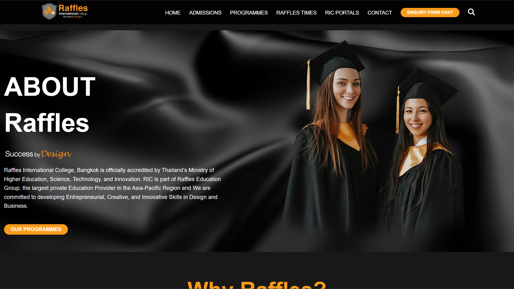

# Responsive Education Website

A modern and fully responsive education landing page built using **HTML** and **CSS**.
This project includes a responsive navigation bar, hero section, programme cards, student statistics, events, activities, registration form, feedback section, and contact footer.

---
🔗 Live Demo: https://reffilescollagewebsiteclone.netlify.app/
## Features

* Responsive Design
* Fixed Navigation Bar
* Hero / Welcome Section
* Programme Cards Layout
* Student Statistics Section
* Event Cards
* Activities Gallery
* Registration Form
* Feedback/Testimonial Section
* Contact Footer
* Mobile and Desktop Support

---

## Technologies Used

* HTML5
* CSS3
* Flexbox
* CSS Grid
* Media Queries

---

## Project Structure

```bash
project-folder/
│
├── index.html
├── style.css
└── assets/
    ├── images/
    └── icons/
```

---

## Responsive Improvements Added

* Navigation menu adapts to smaller screens
* Grid layouts change dynamically
* Images resize automatically
* Forms become single-column on mobile
* Better spacing and typography for tablets and phones
* Prevents horizontal scrolling

---

## Screens Included

* Desktop View
* Tablet View
* Mobile View

---



---

## Author
Developed by [Peter Paing]


